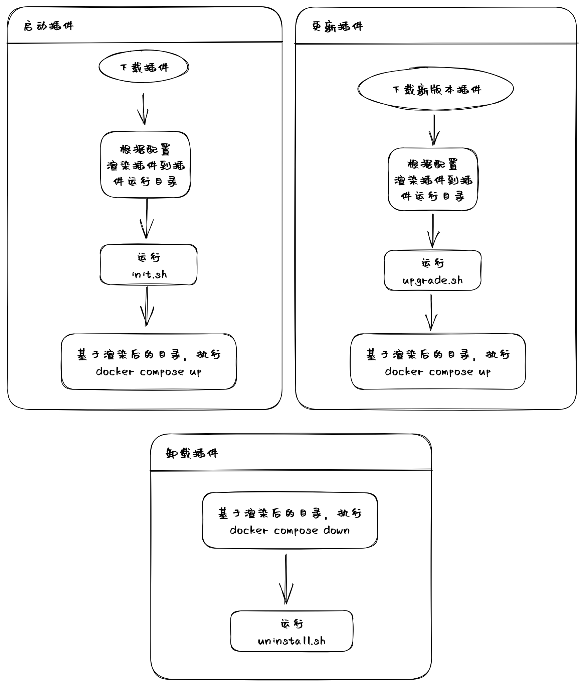

# 🐑 牧云主机安全平台

欢迎使用牧云主机安全平台！我们致力于帮助用户更轻松地管理他们的云主机。

## 🕹️ 使用牧云插件

我们提供了两种使用牧云插件的方式，分别是通过牧云主机管理助手和独立 CLI 工具使用。

### 🌐 通过牧云主机管理助手使用

你可以在 [官网](https://rivers.chaitin.cn/?share=34da0f89e4ff11ed94c80242c0a81705) 安装牧云主机管理助手，安装后即可使用其中的牧云插件。使用过程中遇到的问题欢迎来这里发 Issue.

### 💻 通过独立 CLI 工具使用

#### 通过 cargo 安装 (🔥推荐)

Arch Linux:

```shell
# Install openssl-dev first
sudo pacman -S pkg-config openssl
cargo +nightly install collie-app-cli
```

Debian and Ubuntu:

```shell
sudo apt install pkg-config libssl-dev
cargo +nightly install collie-app-cli
```

CentOS:

```shell
yum install pkg-config openssl-devel
cargo +nightly install collie-app-cli
```

Fedora:

```shell
sudo dnf install pkg-config openssl-devel
cargo +nightly install collie-app-cli
```

Alpine Linux:

```shell
apk add pkgconfig openssl-dev
cargo +nightly install collie-app-cli
```

macOS (Homebrew):

```shell
brew install openssl@3
cargo +nightly install collie-app-cli
```

macOS (MacPorts):

```shell
sudo port install openssl
cargo +nightly install collie-app-cli
```

macOS (pkgsrc):

```shell
sudo pkgin install openssl
cargo +nightly install collie-app-cli
```

#### 手工安装

1. 从 [Release](https://github.com/chaitin/collie-app-cli/releases/latest) 下载 合你系统的 CLI 工具
2. 复制到你的 bin 目录

## 🔨 牧云插件快速开发指南

> 首先你需要参考上一节安装 CLI 工具

### 创建模版应用

```shell
collie-app-cli new <your_new_app>
```

### 修改你的应用

```shell
cd <your_new_app>
# edit your template app
```

详细参见：

1. [应用结构说明](#应用结构说明)
2. [manifest.yaml 说明](#manifest)
3. [应用生命周期说明](#应用生命周期说明)

### 查看渲染结果

```shell
collie-app-cli up --dry
```

渲染结果在 **.render**

### 实际测试

启动应用:

```shell
collie-app-cli up
```

停止应用:

```shell
collie-app-cli down
```

## 应用结构说明

```shell
redis
├── config                  # 可选的自定义文件夹（嵌套文件夹，最大 10 层）
│   └── redis.conf          # 可选的自定义文件
├── docker-compose.yaml     # 必要的 docker compose 描述文件
├── favicon.png             # 必要的 应用图标
├── manifest.yaml           # 必要的 应用核心 manifest 文件
└── scripts                 # 必要的 脚本文件目录
    ├── init.sh             # 必要的 安装后的自定义初始化脚本（无需可留空）
    ├── uninstall.sh        # 必要的 卸载后的自定义卸载脚本（无需可留空）
    └── upgrade.sh          # 必要的 升级后的自定义卸载脚本（无需可留空）
```

## Manifest

```yaml
metadata:
  name: redis                               # 插件名字
  desc: fast kv database.                   # 插件描述
  tags:                                     # 插件标签
    - web
  version: 0.1.0                            # 插件版本
  homepage: https://example.com             # 插件主页
  author:                                   # 作者信息
    name: your_name
    mail: your_name@example.com
  resource:                                 # 该插件所需要的资源
    limit:                                  # 最低资源限制
      cpu: 1                                # 所需的 CPU 核心数量
      memory: 1024M                         # 所需的内存，支持后缀，如 M，G，Mib，MiB，GiB 等
      disk: 1G                              # 所需的磁盘，支持后缀，如 M，G，Mib，MiB，GiB 等
    recommend:
      cpu: 2
      memory: 2048M
      disk: 2G

templates:                                  # 需要渲染的模版列表，路径时相对于插件目录的
  - docker-compose.yaml
  - config/custom.conf

ports:
  web:                                      # 用于在模版中使用的名字 访问该变量的语法 {{ports.web.ip}}:{{ports.web.port}}
    ip: 0.0.0.0                             # 端口绑定的 IP
    port: 80                                # 端口绑定的 端口
    desc: web                               # 描述信息，会在牧云主机助手创建应用时显示

variables:
  password:                                 # 用于在模版中使用的名字 访问该变量的语法 {{variables.password.value}}
    name: 服务密码                           # 描述性的名字，如 XX 密码
    desc: 用于访问服务时用的密码，请注意复杂度  # 提示性的描述信息，如 请注意密码复杂度
    value: wPMihYE                          # 默认的值，可以在创建应用时通过 UI 覆盖
```

## 应用生命周期说明


